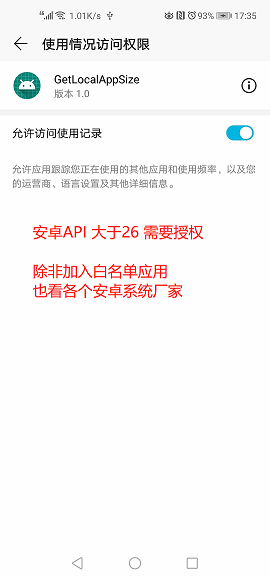
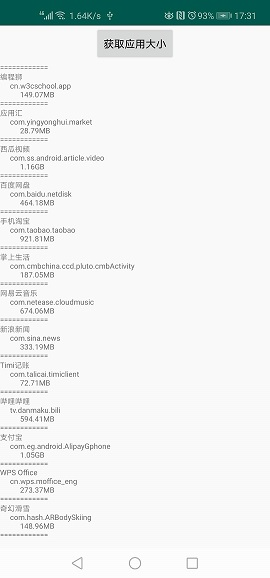

# GetLocalAppSize
Android获取app应用程序大小  含Android8前后获取方法

###
8.0 前可以通过反射 aidl 的 方式获取到数据，8.0以后则需要获取 权限。
另外 工具类中获取应用大小的处理，有两个，一个是用的1024计算，一个用的1000计算。
是因为之前用 1024 计算出来的数据 和手机自带的应用管理得到结果不一致。如果有小伙伴知道原因 可以告知下，感激不尽！

联系方式：
  QQ:980373417
  欢迎一起学习

